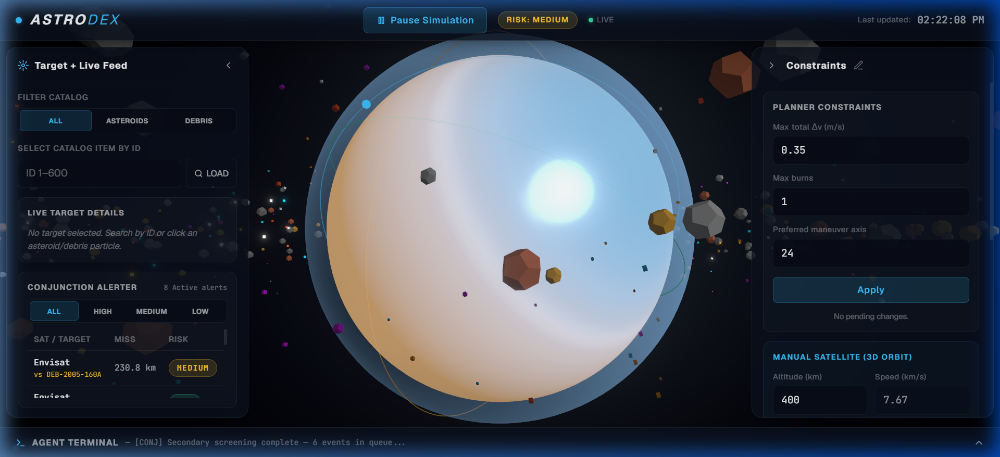
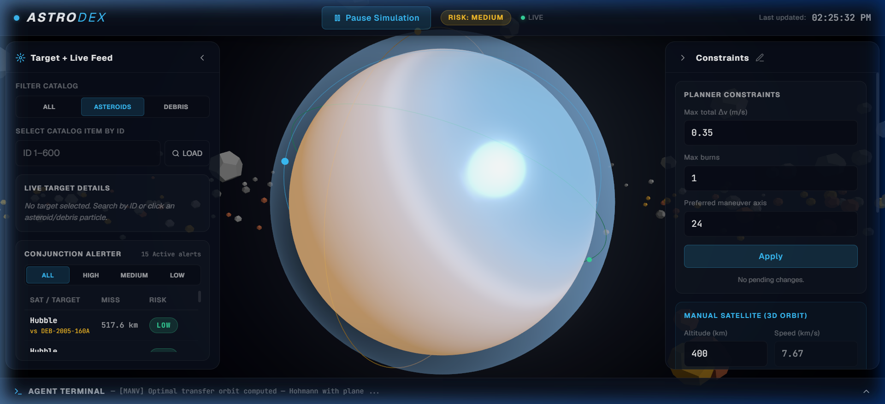
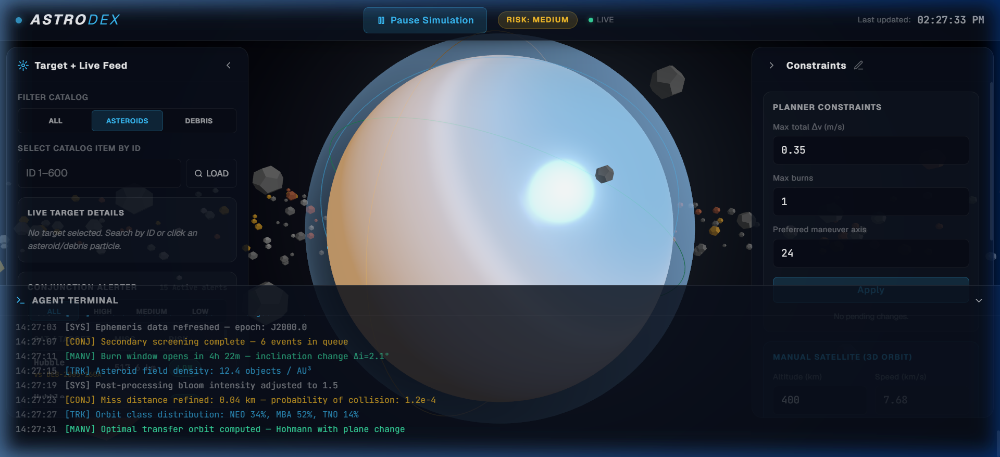

<p align="center">
  
</p>

<h1 align="center">🌌 AstroDex — Space Objects & Debris Explorer</h1>

<p align="center">
  <strong>An interactive, open-source 3D space situational awareness (SSA) dashboard and command center.</strong><br/>
  Visualize asteroids, track orbital debris, and monitor conjunction threats with active satellites — all in real-time.
</p>

<p align="center">
  <a href="https://astrodex-nine.vercel.app"></a>
  <a href="https://github.com/SourabhX16/astrodex/issues"></a>
  <a href="https://github.com/SourabhX16/astrodex/pulls"></a>
  <a href="https://github.com/SourabhX16/astrodex/blob/main/LICENSE"></a>
  <a href="https://github.com/SourabhX16/astrodex/stargazers"></a>
  <a href="https://github.com/SourabhX16/astrodex/network/members"></a>
</p>

---

## 🔗 Live Demo

> **👉 [https://astrodex-nine.vercel.app](https://astrodex-nine.vercel.app)**

Open in a Chromium-based browser (Chrome, Edge, Brave) for the best WebGL experience. A dedicated GPU is recommended for smooth 60 fps rendering of 600+ orbital objects.

---

## 📸 Screenshots

### Mission Control Dashboard
The full HUD overlay with 3D Earth, asteroid field, satellite orbits, and real-time conjunction alerts.



### Asteroid Filter & Conjunction Alerter
Filter the orbital catalog by object type. The Conjunction Alerter panel displays live close-approach events with miss distance and risk classification.



### Agent Terminal (Expanded)
The expandable Agent Terminal logs real-time sensor sweeps, conjunction screenings, maneuver burns, and orbital tracking data.



---

## 🛠️ Tech Stack

| Layer | Technology | Purpose |
|-------|-----------|---------|
| **Framework** | [Next.js 16](https://nextjs.org/) (App Router) | Server/client rendering, routing, and build tooling |
| **UI Library** | [React 19](https://react.dev/) | Component-based UI architecture |
| **3D Engine** | [Three.js](https://threejs.org/) | WebGL rendering, geometries, and materials |
| **React ↔ 3D** | [React Three Fiber (R3F)](https://r3f.docs.pmnd.rs/) | Declarative Three.js in React |
| **3D Helpers** | [@react-three/drei](https://drei.docs.pmnd.rs/) | Stars, camera controls, and instanced mesh utilities |
| **Post-Processing** | [@react-three/postprocessing](https://github.com/pmndrs/postprocessing) | Bloom, vignette, and cinematic effects |
| **Shaders** | Custom GLSL | Earth day/night rendering, atmosphere scattering, cloud layers |
| **Language** | [TypeScript](https://www.typescriptlang.org/) | Type-safe development with strict mode |
| **Styling** | Vanilla CSS + CSS Variables | Glassmorphic design system with custom properties |
| **Fonts** | [Geist](https://vercel.com/font) + [JetBrains Mono](https://www.jetbrains.com/lp/mono/) | UI typography + monospace terminal |
| **Linting** | [ESLint](https://eslint.org/) | Code quality and consistency |
| **Deployment** | [Vercel](https://vercel.com/) | Zero-config hosting for Next.js |

---

## 🌌 Core Features

- **Multi-Object Catalog Tracking**:
  - **400 Rocky Asteroids (Natural)**: Rendered in grey-brown rock textures, each on its own random elliptical orbit (`e ∈ [0, 0.28)`).
  - **200 Space Debris Pieces (Man-made)**: Spent rocket stages, dead satellites, and metallic fragments orbiting closer to Earth, rendered in high-visibility neon colors (orange, cyan, magenta).
- **True Keplerian Orbital Mechanics**:
  - Every object (asteroids, debris, and the 3 satellites) is propagated by solving **Kepler's Equation** `M = E − e·sin(E)` with a Newton-Raphson solver in `src/lib/kepler.ts`.
  - Per-frame **Vis-Viva** speed `v = √(μ·(2/r − 1/a))` — objects accelerate at perigee and decelerate at apogee.
  - Orbit-line geometries are drawn as true ellipses sweeping eccentric anomaly, not circles.
- **LEO Orbital Decay & Boost Burn**:
  - The ISS altitude continuously drops from atmospheric drag (`0.05 km/s` of real time, clamped to 180 km re-entry floor / 500 km ceiling).
  - The Right Sidebar **LEO Decay Monitor** shows a green → amber → red health bar plus the current altitude and drag rate.
  - Clicking **Boost Burn (+50 km)** injects Δv that restores the orbit; the boost is logged to the Agent Terminal.
  - As the ISS decays the orbit ring visibly shrinks and conjunction risks with debris rise.
- **Interactive Satellite System**:
  - Renders 3D orbital planes for active satellites: **ISS (ZARYA)**, **Envisat (Polar)**, and **Hubble Space Telescope**.
  - Satellites move along realistic inclined Keplerian trajectories.
- **Real-Time Conjunction Alerting**:
  - Performs live 3D collision detection between satellites and the orbital catalog.
  - Triggers alerts inside the **Conjunction Alerter** panel and log notifications in the **Agent Terminal** if a space object approaches within critical distance.
  - Highlights at-risk objects in the 3D viewport by flashing their colors to a pulsing red indicator.
- **Dynamic Orbital Telemetry Controls**:
  - The Right Sidebar's **Manual Satellite (3D Orbit)** panel is fully functional. Update parameters (Altitude, Inclination, RAAN, Eccentricity) and click **Apply Trajectory** to watch the ISS satellite and its elliptical orbit trail dynamically recalculate and warp in 3D in real-time.
- **Cinematic Earth Shader**:
  - Custom GLSL material blending Earth day/night textures dynamically based on sun angle, highlighting glowing cities, ocean specular reflections, a twilight terminator ring, and atmospheric Rayleigh scattering effects.
- **Agent Terminal**:
  - Expandable bottom terminal dock generating monospace logs of sensor sweeps, conjunction alerts, and maneuver sequences (including boost burns).

---

## 🚀 Getting Started

### Prerequisites

| Tool | Version | Notes |
|------|---------|-------|
| [Node.js](https://nodejs.org/) | **18+** | LTS recommended (includes npm) |
| [npm](https://www.npmjs.com/) | **9+** | Bundled with Node.js |
| [Git](https://git-scm.com/) | Any recent | For cloning and version control |

> [!TIP]
> Run `node -v` and `npm -v` to verify your installed versions.

### Installation

```bash
# 1. Fork the repository on GitHub, then clone your fork
git clone https://github.com/<your-username>/astrodex.git
cd astrodex

# 2. Add the upstream remote (to stay in sync)
git remote add upstream https://github.com/SourabhX16/astrodex.git

# 3. Install dependencies
npm install
```

### Running Locally

```bash
# Start the development server with hot-reload
npm run dev
```

Open **[http://localhost:3000](http://localhost:3000)** in your browser. Changes are reflected instantly via hot-reload.

> [!NOTE]
> The 3D scene may take a few seconds to initialize on first load while WebGL compiles the GLSL shaders and generates procedural textures.

---

## 🏗️ Build & Deployment

### Production Build

```bash
# Compile TypeScript and build the optimized production bundle
npm run build

# Start the production server locally
npm run start
```

The production server runs on **[http://localhost:3000](http://localhost:3000)** by default.

### Available Scripts

| Script | Command | Description |
|--------|---------|-------------|
| `dev` | `npm run dev` | Start the development server with hot-reload |
| `build` | `npm run build` | Create an optimized production build |
| `start` | `npm run start` | Serve the production build locally |
| `lint` | `npm run lint` | Run ESLint to check for code quality issues |

### Deploying to Vercel

AstroDex is designed for zero-config deployment on [Vercel](https://vercel.com/):

1. **Import your fork** on [vercel.com/new](https://vercel.com/new)
2. Vercel auto-detects the Next.js framework — **no configuration needed**
3. Click **Deploy** and your app goes live with HTTPS, CDN, and serverless functions

---

## 🧪 Testing & Validation

### Type Checking

```bash
# Run the TypeScript compiler in check-only mode (no output emitted)
npx tsc --noEmit
```

### Linting

```bash
# Run ESLint across the entire project
npm run lint
```

### Build Validation

```bash
# Verify the project compiles successfully for production
npm run build
```

### Pre-PR Checklist

Before opening a pull request, ensure all of the following pass:

```bash
npm run lint          # ✅ No new lint errors
npx tsc --noEmit      # ✅ No type errors
npm run build         # ✅ Build completes successfully
```

> [!IMPORTANT]
> All three checks must pass with **zero new errors** before submitting a PR. Existing lint warnings in `src/components/earth/CloudLayer.tsx` and `src/components/earth/Earth.tsx` are known issues related to React compiler/ref lint rules and are not blockers.

---

## 📂 Project Structure

```text
astrodex/
├── public/                     # Static assets
├── src/
│   ├── app/
│   │   ├── globals.css         # Mission Control theme tokens, glassmorphism, animations
│   │   ├── layout.tsx          # Font loading (Geist & JetBrains Mono), SEO metadata
│   │   └── page.tsx            # HUD overlay layout assembly
│   ├── components/
│   │   ├── earth/
│   │   │   ├── Earth.tsx       # Earth day/night custom GLSL shader
│   │   │   ├── CloudLayer.tsx  # Procedural cloud layer
│   │   │   ├── Atmosphere.tsx  # Atmosphere scattering shader glow
│   │   │   └── textures.ts    # Canvas 2D texture generators (zero external assets)
│   │   ├── AsteroidField.tsx   # Dual InstancedMesh (Asteroids & Space Debris) — Keplerian
│   │   ├── SatelliteSystem.tsx # ISS/Envisat/Hubble + LEO decay
│   │   ├── CameraController.tsx # Tracking camera controller
│   │   ├── Effects.tsx         # Post-processing composer (Bloom, Vignette)
│   │   ├── Scene.tsx           # Orchestrator canvas
│   │   ├── Header.tsx          # Simulation top navigation bar
│   │   ├── LeftSidebar.tsx     # Target tracking, load by ID, conjunction feed
│   │   ├── RightSidebar.tsx    # Orbital constraints + manual satellite + LEO decay monitor
│   │   ├── AgentTerminal.tsx   # Expandable log dock (auto-scrolls, color-coded)
│   │   └── AsteroidCard.tsx    # Inspector overlay panel
│   └── lib/
│       ├── kepler.ts           # Newton-Raphson solver, Vis-Viva, mean motion, decay
│       ├── store.tsx           # React state manager (filters, simulation, orbits, alerts)
│       └── types.ts            # TypeScript definitions
├── ARCHITECTURE.md             # Detailed rendering pipeline & component tree docs
├── CONTRIBUTING.md             # Contribution workflow, code style, and PR process
├── CODE_OF_CONDUCT.md          # Community guidelines
├── CHANGELOG.md                # Version history
├── LICENSE                     # MIT License
├── next.config.ts              # Next.js configuration
├── eslint.config.mjs           # ESLint configuration
├── tsconfig.json               # TypeScript configuration
└── package.json                # Dependencies and scripts
```

---

## 🤝 Contributing

We welcome contributions! For the full process and guidelines, see [CONTRIBUTING.md](./CONTRIBUTING.md). In short: comment on an issue to claim it, open a focused branch for your work, and submit a PR with a clear description and testing steps. Helpful quick rules:
- Comment on the issue expressing interest so maintainers can assign it.
- Create a focused branch with a descriptive name (e.g., `feat/…`, `fix/…`, `docs/…`).
- Keep PRs small and include steps to reproduce or test.

## 🎨 Coding style / Linting / Formatting

AstroDex uses TypeScript (strict mode), ESLint, and Tailwind. Follow the conventions in [CONTRIBUTING.md#code-style](./CONTRIBUTING.md#code-style) (use `@/` path alias, add `"use client"` for client components, avoid `any`, remove unused imports). Run these commands before opening a PR:
- `npm run lint`
- `npx tsc --noEmit`
- `npm run build`

## 📄 License

This project is licensed under the [MIT License](LICENSE).

---

<p align="center">
  Made with ❤️ by the <a href="https://github.com/SourabhX16/astrodex/graphs/contributors">AstroDex contributors</a>
</p>
