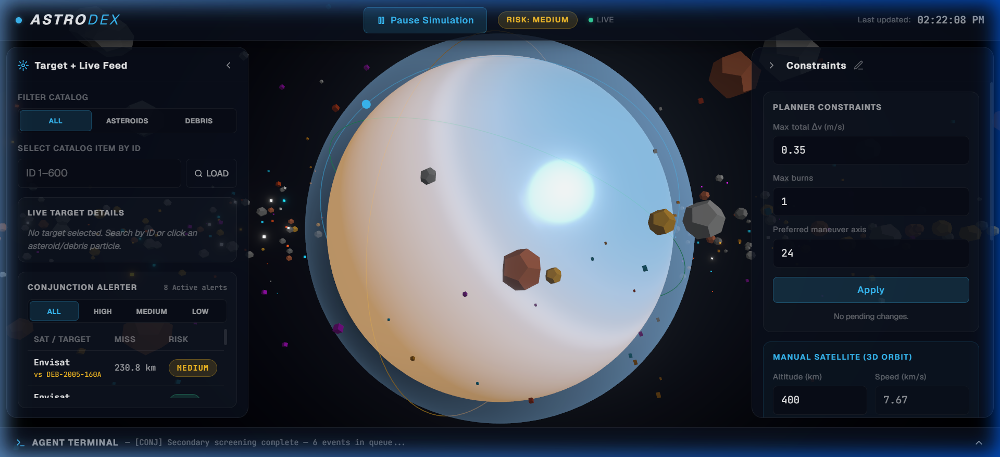

# AstroDex 🌌

**Interactive 3D Space Situational Awareness & Keplerian Orbital Explorer**

[](https://astrodex-nine.vercel.app)
[](https://github.com/Omnikon-Org/Astrodex/issues)
[](https://github.com/Omnikon-Org/Astrodex/pulls)
[](https://github.com/Omnikon-Org/Astrodex/blob/main/LICENSE)
[](https://github.com/Omnikon-Org/Astrodex/stargazers)
[](https://github.com/Omnikon-Org/Astrodex/network/members)
[](https://nextjs.org/)
[](https://threejs.org/)
[](https://www.typescriptlang.org/)
[](https://tailwindcss.com/)

AstroDex is an interactive 3D space situational awareness (SSA) dashboard and mission control simulator. Powered by Next.js 16, React Three Fiber, and custom GLSL shaders, AstroDex renders 600+ instanced asteroids and orbital debris items on real-time Keplerian trajectories around a cinematic Earth.

---

## 📸 Mission Control Dashboard



---

## ✨ Features

- 🌍 **Cinematic Earth Shaders**: Custom GLSL shaders blending day/night textures, city light glow, specular ocean reflections, procedural clouds, and Rayleigh atmospheric scattering.
- 🛰️ **Keplerian Orbital Engine**: Analytical orbit solver in [`src/lib/kepler.ts`](src/lib/kepler.ts) solving Kepler's Equation ($M = E - e \sin E$) via Newton-Raphson and calculating per-frame Vis-Viva velocities ($v = \sqrt{\mu (2/r - 1/a)}$).
- ☄️ **600+ Instanced Space Objects**: 400 natural rocky asteroids ($e \in [0, 0.28)$) and 200 artificial debris items rendered in 2 GPU draw calls using React Three Fiber `<InstancedMesh>`.
- ⚠️ **Real-Time Conjunction Alerting**: Continuous 3D proximity screening detecting near-Earth object approaches, triggering flashing threat indicators, sidebar alerts, and monospaced terminal logs.
- 🚀 **LEO Orbital Decay & Re-Boost**: Realistic atmospheric drag simulation continuously decaying ISS altitude; interactive Delta-V boost burn maneuver to restore stable orbit.
- 🎛️ **Manual Trajectory Planner**: Real-time 3D orbit manipulation adjusting Altitude, Inclination, RAAN, and Eccentricity parameters.
- 💻 **Agent Terminal**: Monospaced telemetry log dock auto-recording sensor sweeps, conjunction screenings, and burn maneuvers.
- ♿ **Accessible Mission Control HUD**: Keyboard navigation, screen-reader support, focus traps, and reduced-motion toggles.

---

## 🛠️ Tech Stack

| Layer | Technology | Purpose |
| --- | --- | --- |
| **Framework** | [Next.js 16](https://nextjs.org/) (App Router) | Client/Server rendering, routing, and dynamic imports |
| **UI Library** | [React 19](https://react.dev/) | Component architecture & state hooks |
| **3D Rendering** | [Three.js (r184)](https://threejs.org/) | WebGL scene graph & shaders |
| **React ↔ 3D** | [React Three Fiber (v9)](https://r3f.docs.pmnd.rs/) | Declarative 3D canvas management |
| **3D Helpers** | [@react-three/drei (v10)](https://drei.docs.pmnd.rs/) | Starfield background & instanced mesh utilities |
| **Post-Processing** | [@react-three/postprocessing (v3)](https://github.com/pmndrs/react-postprocessing) | Selective Bloom and Vignette effects |
| **Shaders** | Custom GLSL | Earth day/night, cloud layer, and scattering shaders |
| **Language** | [TypeScript 5](https://www.typescriptlang.org/) | Type safety and strict mode validation |
| **Styling** | [Tailwind CSS v4](https://tailwindcss.com/) | Glassmorphic HUD overlay system |
| **Testing** | [Vitest](https://vitest.dev/) & React Testing Library | Unit and component testing |

---

## ⚡ Quick Start

### Prerequisites

- **Node.js**: `v18.0.0` or higher
- **npm**: `v9.0.0` or higher

### Installation & Local Run

1. Clone the repository:
   ```bash
   git clone https://github.com/Omnikon-Org/Astrodex.git
   cd Astrodex
   ```

2. Install dependencies:
   ```bash
   npm install
   ```

3. Launch the development server:
   ```bash
   npm run dev
   ```

4. Open [http://localhost:3000](http://localhost:3000) in your browser.

> [!NOTE]
> Upon first launch, WebGL shader compilation and procedural texture generation take 1–2 seconds to complete.

> [!TIP]
> Hardware acceleration enabled in a Chromium-based browser (Chrome, Edge, Brave) is recommended for optimal 60 FPS rendering.

---

## 📜 Developer Scripts

| Command | Action |
| --- | --- |
| `npm run dev` | Start development server with hot-reload at `http://localhost:3000` |
| `npm run build` | Build optimized Next.js production bundle |
| `npm run start` | Serve built production app locally |
| `npm run typecheck` | Run TypeScript type checks (`tsc --noEmit`) |
| `npm run test` | Run Vitest unit tests |
| `npm run analyze` | Analyze production bundle sizes |
| `npm run format` | Format code using Prettier |

---

## 🏛️ Architecture Overview

AstroDex separates state management from WebGL rendering to preserve 60 FPS performance:

```text
AppProvider (src/lib/store.tsx)
└── Home (src/app/page.tsx)
    ├── Scene (dynamic, ssr: false)
    │   └── R3F Canvas
    │       └── SceneContent
    │           ├── Earth, CloudLayer, Atmosphere (GLSL)
    │           ├── SatelliteSystem (ISS, Envisat, Hubble)
    │           ├── AsteroidField (Dual InstancedMeshes)
    │           └── Effects (Bloom, Vignette)
    └── Mission Control HUD
        ├── Header & SimStatusBadge
        ├── LeftSidebar (Catalog filter, search, conjunction feed)
        ├── RightSidebar (Trajectory planner, LEO decay monitor)
        ├── AgentTerminal (Telemetry log dock)
        └── AsteroidCard (Target inspector)
```

For full technical specifications, shader derivations, and Keplerian physics models, refer to [`ARCHITECTURE.md`](./ARCHITECTURE.md).

---

## 📂 Project Structure

```text
Astrodex/
├── docs/                       # Screenshots and technical guides
├── public/                     # Static icons and assets
├── src/
│   ├── app/                    # Next.js App Router pages and CSS
│   ├── components/             # HUD overlays and 3D WebGL components
│   │   ├── earth/              # GLSL Earth, clouds, atmosphere, and procedural textures
│   │   └── ui/                 # Reusable UI controls and dialogs
│   ├── hooks/                  # Custom React hooks
│   ├── lib/                    # Keplerian mechanics, store, and types
│   └── types/                  # Global TypeScript definitions
├── tests/                      # Integration and E2E tests
├── ARCHITECTURE.md             # In-depth architectural guide
├── CONTRIBUTING.md             # Contribution guidelines
├── LICENSE                     # MIT License
└── package.json                # Dependencies and npm scripts
```
Made with ❤️ by the [AstroDex contributors](https://github.com/Omnikon-Org/Astrodex/graphs/contributors)